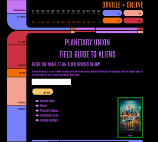

<h1 align="center">Orville Application to find species | <a href="https://tonyherbert22atx.github.io/Orville-APP/">Visit here!</a></h1>

<h3 align="center">Species application using an API I built</h3>
 

## How It's Made:

This was my first attempt at creating an application using an API I created and hosted on Heroku.

<h2 align="center">Techs used:</h2>
 

    
    
    
    

##
 

## Optimizations

I am planning to add more species to this application. 
I also plan to add more infomration for each species. 

